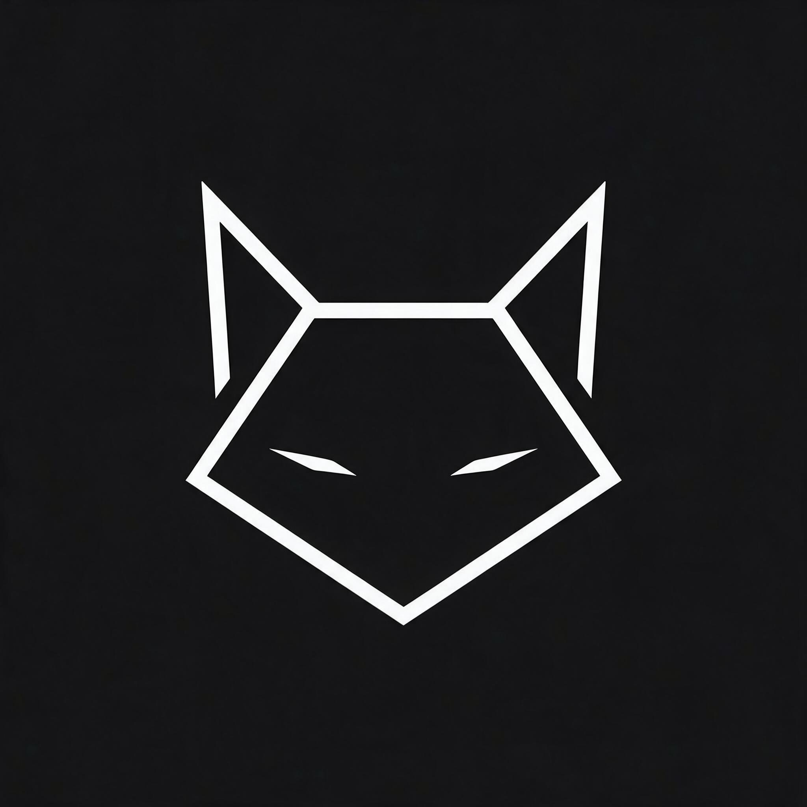

# AI-Kayori 🐾 — v1.0.0

> Чёрный, тёмно-серый, серый, белый. Котик-логотип. Приватный AI-ассистент.



**AI-Kayori** — красивый AI-чат с кастомным окном, автообновлением, историей, загрузкой фото, генерацией изображений и поддержкой 5 моделей.

### ✨ Фичи
- **Дизайн:** чёрный #0A0A0A, тёмно-серый #121212, серый #242424, белый #FFFFFF. Кастомный TitleBar (крестик, квадрат, полоска в стиле приложения). Плавные анимации framer-motion.
- **Чаты:** создание, переименование, удаление, поиск, история в IndexedDB. Черновик сохраняется если случайно перешёл в другой чат или вышел.
- **Модели (с иконками и версиями):**
  - 🔷 Google Gemini 1.5 Flash — `gemini-1.5-flash-latest`
  - 🦙 Llama 3.1 8B Instruct — `@cf/meta/llama-3.1-8b-instruct`
  - 🦙 Llama 3 8B Instruct — `@cf/meta/llama-3-8b-instruct`
  - 🌬️ Mistral 7B v0.2 — `@cf/mistral/mistral-7b-instruct-v0.2`
  - 💫 Qwen 1.5 7B AWQ — `@cf/qwen/qwen1.5-7b-chat-awq`
- **Сообщения:** пузырьки, аватарка котика у AI, пишет что за нейросеть и версия. Поддержка markdown, кода.
- **Фото:** 📎 загрузка для осмотра (vision) через Gemini. Генерация изображений через Cloudflare `@cf/stabilityai/stable-diffusion-xl-base-1.0` по триггерам "нарисуй", "сгенерируй".
- **Yandex ID:** кнопка входа, OAuth `https://oauth.yandex.ru/authorize`. Токен хранится локально.
- **Мини-окно и F11:** PiP режим, полноэкранный.
- **Сборки с версией в имени:**
  - PC Setup: `AI-Kayori-Setup-v1.0.0.exe` (NSIS installer)
  - PC Portable: `AI-Kayori-Portable-v1.0.0.exe` (без установки)
  - Android APK: `AI-Kayori-v1.0.0.apk` (Capacitor)
- **Автообновление:** проверка при запуске, скрипт `check-updates.js`, electron-updater в проде.
- **Безопасность:** запрет на поиск личного, запрещёнки. PRIVACY.md.

### 🚀 Запуск

```bash
npm install
npm run dev # веб на http://localhost:5173

# Electron (кастомное окно)
npm run electron:dev

# Сборки
npm run electron:build:setup    # Setup exe с версией
npm run electron:build:portable # Portable exe с версией
npm run build:apk               # APK через Capacitor

# Версионирование
npm run version:patch # 1.0.0 -> 1.0.1 + обновляет файлы
npm run check-updates
```

### 🔑 .env

```
VITE_GOOGLE_API_KEY=YOUR_GOOGLE_API_KEY_HERE
VITE_CF_ACCOUNT_ID=
VITE_CF_API_TOKEN=YOUR_CF_API_TOKEN_HERE
VITE_YANDEX_CLIENT_ID=
```

> ⚠️ Не коммить реальные ключи! Используй .env.example

### 🎨 Логотип
- Чёрный фон #121212, белая иконка — геометричный котик из линий, острые ушки, узкие глаза.
- `public/logo-kayori.png` — 1024x1024, используется в TitleBar, сообщениях, иконке приложения.
- Иконки: `public/icons/icon.png` (512, 256, 128, 64, 32)

### 📱 APK
- Capacitor: `npx cap init`, `npx cap add android`, `npx cap copy`
- Цвет статус бара — чёрный, edge-to-edge.

### 🖥️ Custom Window
- Electron `frame: false`, `titleBarStyle: hidden`
- Свои кнопки: минимизировать (полоска), развернуть (квадрат), закрыть (крестик) — в стиле приложения, белые на чёрном, hover эффекты.
- Drag region для перемещения.

### 🧠 Память черновика
- При вводе текст сохраняется каждые 300ms в `global-draft` и `draft-{chatId}` в IndexedDB.
- При переключении чата — восстанавливается.

### 📄 Политика
См. `PRIVACY.md` — запрещено искать личное, инструкция по оружию/наркотикам и т.д.

### 🛠 Технологии
Vite + React + TypeScript + Tailwind + Zustand + IndexedDB (idb) + Framer Motion + Electron + Capacitor + Google Gemini + Cloudflare Workers AI + Yandex ID

---

Сделано с 🐾 для Kayori. Версия в файле — чтобы не спутал когда скачал.
